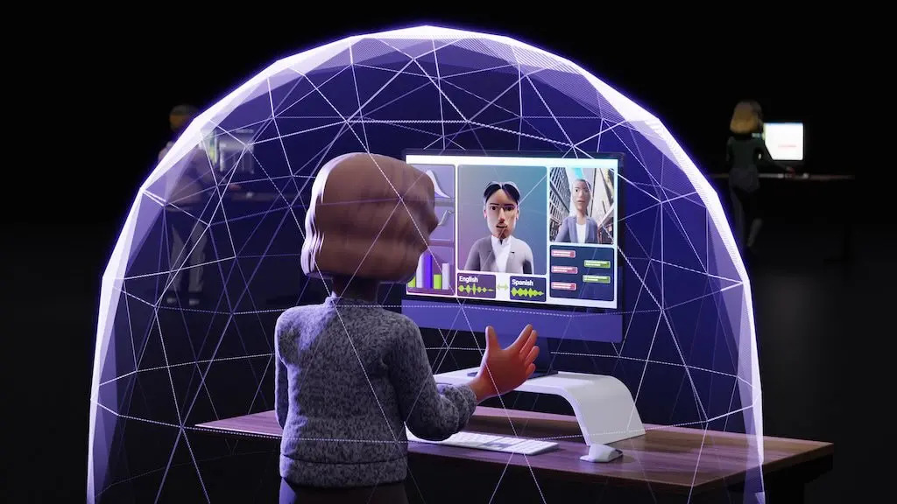
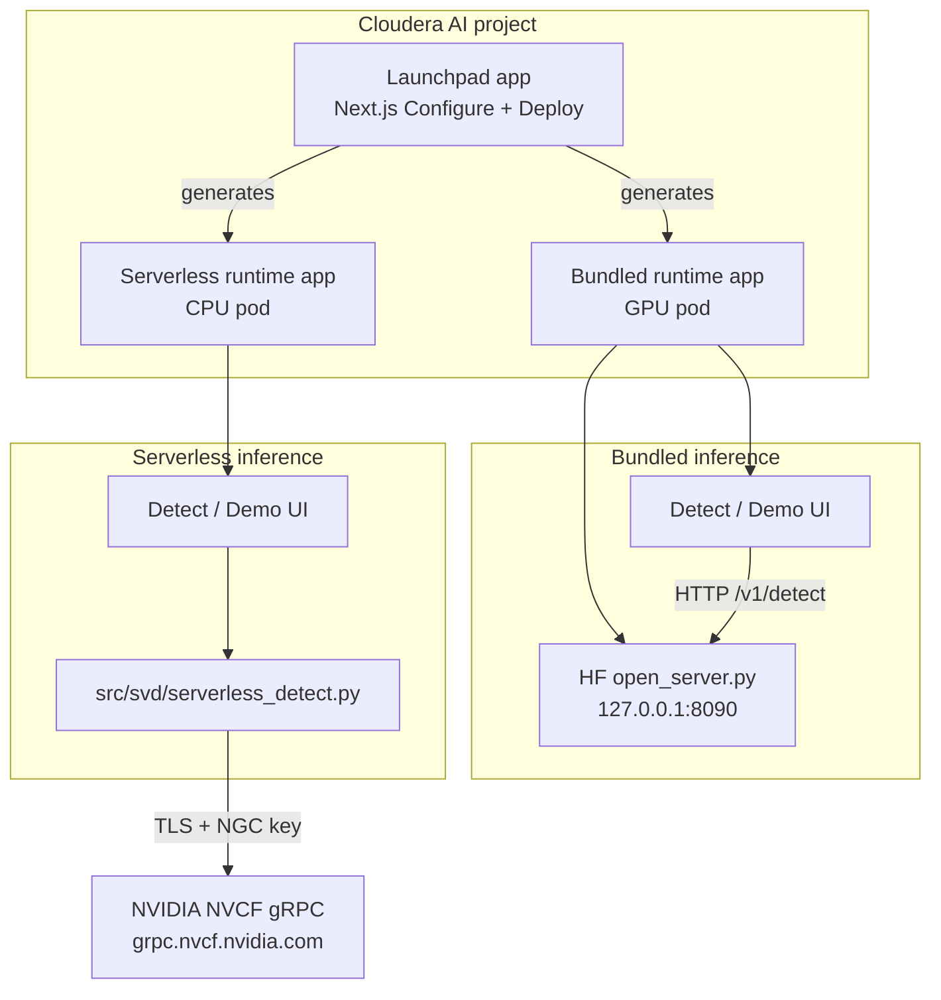

# Cloudera Blueprint: Synthetic Video Detector

<p align="center">
  
</p>


> Detect deepfakes and synthetic video in media workflows on **Cloudera AI**. Launchpad deploys **Bundled** GPU applications (curated Hugging Face models in-pod) or **Serverless** CPU applications (optional NVIDIA Cloud Functions gRPC)—each with the same Detect and Demo UI.

## Table of Contents

- [Overview](#overview)
- [Demo](#demo)
- [Use Case](#use-case)
- [Key Features](#key-features)
- [Quickstart](#quickstart)
- [Architecture / Software Components](#architecture--software-components)
- [Target Audience](#target-audience)
- [Repository Structure](#repository-structure)
- [Prerequisites](#prerequisites)
- [Hardware Requirements](#hardware-requirements)
- [Documentation](#documentation)

## Overview

The Synthetic Video Detector blueprint helps teams assess **clip-level synthetic likelihood** in MP4 media inside a Cloudera AI project. A **Launchpad** application configures deployment, builds the UI, and generates standalone **runtime** applications. **Bundled** mode runs open-weights models (VideoMAE or frame classifiers) on a GPU in your tenant—no external inference API required for detection. **Serverless** mode sends video to NVIDIA-hosted Synthetic Video Detector inference over gRPC when you supply an NGC API key and NVCF function ID. Both paths share one custom runtime image edition (**SyntheticVideoDetector**) and the same Next.js detection experience.

## Demo

- **Catalog asset:** [assets/synthetic-video-detector.jpg](assets/synthetic-video-detector.jpg)
- **Sample media:** [assets/real_sample_video.mp4](assets/real_sample_video.mp4) (camera footage, Seattle USA), [assets/fake_sample_video.mp4](assets/fake_sample_video.mp4) (generated with Gemini 3.6 Thinking) — two independent ~10 s clips original to this blueprint; see [assets/SAMPLE_VIDEOS_ATTRIBUTION.md](assets/SAMPLE_VIDEOS_ATTRIBUTION.md)
- **Reprise / walkthrough:** [_https://app.getreprise.com/present/3yAMwNy_](https://app.getreprise.com/present/3yAMwNy)

After deployment, open the **Bundled** or **Serverless** runtime URL → **Detect** → upload MP4 → view timeline scores and aggregate verdict.

## Use Case

**Problem:** Newsrooms, trust & safety, and compliance teams need repeatable checks for AI-manipulated or fully synthetic video without standing up a bespoke ML platform.

**Outcome:** Operators deploy a governed Cloudera AI application, run clip-level analysis on MP4 inputs, and integrate results into editorial or integrity workflows. Bundled mode supports **air-gapped-style** GPU inference (HF weights in-project); Serverless mode aligns with **NVIDIA-calibrated** production scoring when cloud API use is acceptable.

## Key Features

- **Dual deploy modes** from one blueprint: **Bundled (GPU + Hugging Face)** and **Serverless (NVCF gRPC)**.
- **Launchpad UI** to save configuration, deploy runtime apps, and track model-server startup.
- **Three curated HF presets** (VideoMAE, SigLIP 3-class, ViT binary) via `cai/config/open_model_catalog.json`.
- **Clip-level timeline** and aggregate synthetic probability in the Detect UI (streaming progress for long runs).
- **Custom ML runtime** (`Dockerfile` → register `cai/runtime/METADATA.yaml` in the Runtime Catalog).
- **Bundled path** does not embed NVIDIA detector weights; **Serverless** uses customer NGC credentials to call hosted inference.

## Runtime image (Docker Hub)

Prebuilt **SyntheticVideoDetector** edition **1.12** (linux/amd64):

| Tag | Use |
| --- | --- |
| [`kevintalbert/synthetic-video-detector:latest`](https://hub.docker.com/r/kevintalbert/synthetic-video-detector) | Current release (points at **1.12**) |

Register the image in your Cloudera AI **Runtime Catalog** with edition **SyntheticVideoDetector** and short version **1.12** (`cai/runtime/METADATA.yaml`).

## Quickstart

1. **Clone** this repository into a Cloudera AI project (or sync from Git).
2. **Register the runtime** from Docker Hub (`latest` or `1.12`) or build locally (`./scripts/docker/build-svd-image.sh`) as edition **SyntheticVideoDetector** in your Runtime Catalog.
3. **Run AMP tasks** (project metadata in `.project-metadata.yaml`):
   - Install Python Dependencies (`cai/amp/1_install/install_dependencies.py`)
   - Build UI (`cai/amp/6_demo_ui/build_demo.py`)
   - Start **Synthetic Video Detector Launchpad** (`cai/amp/6_demo_ui/start_demo.py`)
4. Open the **Launchpad** URL → **Configure** → set **Bundled** and/or **Serverless** options → **Deploy**.
5. Open the **runtime application URL** → wait for model startup (Bundled) → **Detect** → upload MP4.

For local image build (optional, on a Linux/amd64 builder):

```bash
export SVD_RUNTIME_REGISTRY=kevintalbert   # optional: also tag kevintalbert/synthetic-video-detector:*
./scripts/docker/build-svd-image.sh        # tags :1.12, :latest, and *-turing variants
```

See [cai/README.md](cai/README.md) for AMP details, presets, and troubleshooting.

## Architecture / Software Components



| Component | Role |
| --- | --- |
| **Cloudera AI** | Projects, applications, GPU scheduling, runtime catalog |
| **Launchpad** (`start_demo.py`) | Configuration, deploy control plane, UI build |
| **Bundled runtime** (`launch_bundled_app.py`) | HF model server + UI in one GPU application |
| **Serverless runtime** (`launch_serverless_app.py`) | UI + gRPC client to NVCF (no local model) |
| **Custom runtime image** | Python 3.13, PyTorch/Transformers (open), gRPC client (serverless extra) |
| **Hugging Face Hub** | Model weights downloaded at runtime for Bundled presets |
| **NVCF** (optional) | Hosted NVIDIA Synthetic Video Detector when Serverless is enabled |

## Target Audience

- **ML / media engineers** deploying detection apps on Cloudera AI
- **Solution architects** designing trust, safety, or integrity pipelines on CAI
- **Sales engineers** demoing Bundled (offline GPU) vs Serverless (NVIDIA-calibrated) paths
- **Developers** extending presets, thresholds, or UI in `client/demos` and `src/svd`

## Repository Structure

| Path | Description |
| --- | --- |
| `assets/` | Catalog image, sample MP4s for smoke tests |
| `cai/` | AMP scripts, deployment library, runtime metadata, open model catalog |
| `cai/amp/` | Install, UI build, Launchpad, bundled/serverless app entrypoints |
| `cai/runtime/METADATA.yaml` | ML runtime edition registration (SyntheticVideoDetector) |
| `client/demos/` | Next.js Launchpad and Detect UI |
| `src/svd/` | Detection client, HF inference server, optional NVCF gRPC client |
| `protos/` | gRPC API definitions (MIT-licensed client contract for Serverless) |
| `scripts/docker/` | Runtime image build script |
| `Dockerfile` | Single image: Bundled (HF) + Serverless (client) Python extras |
| `METADATA.yaml` | Cloudera blueprint website / catalog metadata (standard schema) |
| `catalog-entry.yaml` | Community blueprint catalog entry |
| `.project-metadata.yaml` | CAI project AMP task definitions |
| `pyproject.toml` | Python dependencies (`open`, `serverless` extras) |

## Prerequisites

- **Cloudera AI** project with permission to create **Applications** and (for Bundled) **GPU** quota
- **Custom runtime** registered from this blueprint’s Docker image (edition **SyntheticVideoDetector**)
- **Runtime catalog / engine** compatible with the image (see `cai/runtime/METADATA.yaml`)
- **Bundled:** optional **Hugging Face token** (`HF_TOKEN`) for gated models; outbound HTTPS to Hugging Face Hub
- **Serverless:** **NGC API key** and **NVCF function ID** (`NGC_API_KEY`, `SVD_NVIDIA_FUNCTION_ID`); outbound HTTPS to `grpc.nvcf.nvidia.com`
- **Launchpad build:** Node.js available in project or pre-built UI in runtime image
- **Tools (image build hosts only):** Docker, `git`, network access to pull base ML runtime and PyPI

## Hardware Requirements

| Deployment | Minimum |
| --- | --- |
| **Launchpad** (configure / deploy UI) | 2 vCPU, 8 GiB RAM (no GPU) |
| **Bundled runtime** (HF inference + UI) | 4 vCPU, 32 GiB RAM, **1× NVIDIA GPU** (8+ GiB VRAM recommended for VideoMAE preset) |
| **Serverless runtime** (UI + gRPC client) | 2–4 vCPU, 8 GiB RAM (no GPU) |
| **Enterprise / batch** | Scale GPU apps and project storage for HF cache (`HF_HOME`); Serverless bounded by NVCF quotas |

## Documentation

- [cai/README.md](cai/README.md) — AMP flow, presets, ports, troubleshooting
- [Cloudera AI documentation](https://docs.cloudera.com/) — applications, runtimes, and GPU scheduling
- **Environment reference:** [.env.example](.env.example)
- **Blueprint catalog fields:** [`METADATA.yaml`](METADATA.yaml) (see [Cloudera Blueprints Standard](https://github.com/cloudera/Cloudera-Blueprints-Standard) template)
